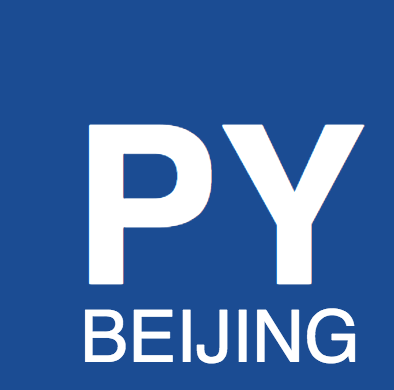

# Beijing Python Meetup

* [Meetup Group](https://www.meetup.com/Beijing-Python/)
* [Github Repository](https://github.com/littlepea/beijing-python-meetup)

## Organizers

### Current:

* [Evgeny Demchenko](https://github.com/littlepea)

### Previous:

* [Mike](https://www.meetup.com/Beijing-Python/members/13585286/)
* [John](https://www.meetup.com/Beijing-Python/members/123183642/)
* [Chris](https://www.meetup.com/Beijing-Python/members/109796062/)

### Contributors:

* [Martin](http://www.meetup.com/members/189020376/)

## Presentations

* [Refactoring Python Code](https://github.com/littlepea/python-refactoring-talk) - [Oct 17, 2016](https://www.meetup.com/Beijing-Python/events/234021155/) by Evgeny Demchenko
* [The Secret Life of Python Attributes](https://github.com/littlepea/beijing-python-meetup/tree/master/2017/201705_attributes_talk) - [May 15, 2017](https://www.meetup.com/Beijing-Python/events/239246991/) by Reuven Lerner

## Lean Coffee Sessions

* [Nov 14, 2016](lean_coffee/201611/)
* [Jan 9, 2017](lean_coffee/201701/)

## Coding Workshops

* [TDD mob programming workshop - Dec 12, 2016](2016/201612_tdd_workshop)

## Other information and links:

* [Sponsorships and Expences tracking](https://docs.google.com/spreadsheets/d/1ELWDQPWvroswoA0lgAYXYg4G35goT0GEuBKqkMQAFa0/edit#gid=0) (Google Sheet)
